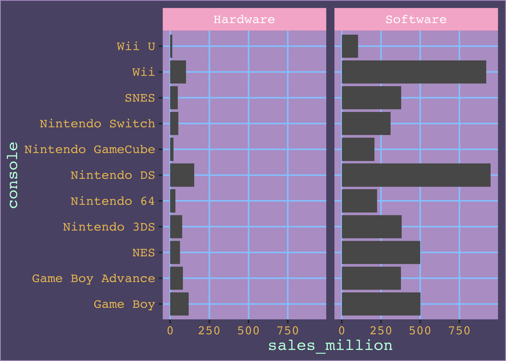
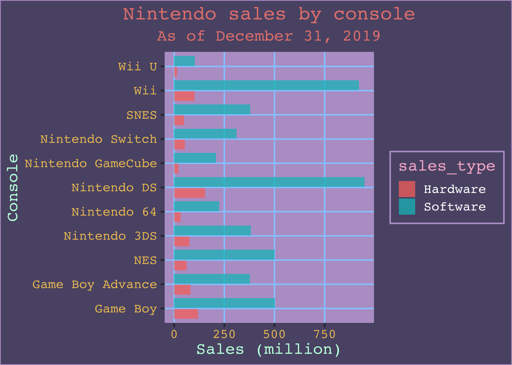

<!-- README.md is generated from README.Rmd. Please edit that file -->

# ggcute

<!-- badges: start -->

<!-- badges: end -->

A collection of cute things to use with ggplot2. Right now `ggcute` only
consists of one thing: a ggplot2 port of
[https://twitter.com/sailorhg](sailorhg)’s
[https://sailorhg.github.io/fairyfloss/](fairyfloss) text editor theme.

## Installation

You can install ggcute from GitHub with:

``` r
# install.packages("remotes")
remotes::install_github("sharlagelfand/ggcute")
```

# theme\_fairyfloss()

`theme_fairyfloss()` is a theme based off of
[https://twitter.com/sailorhg](sailorhg)’s
[https://sailorhg.github.io/fairyfloss/](fairyfloss) text editor theme.

You can use it like any other ggplot2 theme:

``` r
library(ggplot2)
library(ggcute)

ggplot(nintendo_sales, aes(x = sales_million, y = console)) +
  geom_col() +
  facet_wrap(~sales_type) + theme_fairyfloss()
```



``` r

ggplot(nintendo_sales, aes(x = sales_million, y = console, fill = sales_type)) +
  geom_col(position = position_dodge2(width = 0.1), alpha = 0.75) +
  labs(
    x = "Sales (million)", y = "Console", title = "Nintendo sales by console",
    subtitle = "As of December 31, 2019"
  ) +
  theme(legend.title = element_blank()) +
  theme_fairyfloss()
```



It’s probably (definitely) not a complete theme but at least it’s cute
☁️

`ggcute` comes with one data set built in, Nintendo sales as of December
31, 2019:

``` r
nintendo_sales
#> # A tibble: 22 x 3
#>    console         sales_type sales_million
#>    <chr>           <chr>              <dbl>
#>  1 Nintendo Switch Hardware            52.5
#>  2 Nintendo Switch Software           311. 
#>  3 Nintendo 3DS    Hardware            75.7
#>  4 Nintendo 3DS    Software           382. 
#>  5 Wii U           Hardware            13.6
#>  6 Wii U           Software           103. 
#>  7 Wii             Hardware           102. 
#>  8 Wii             Software           921. 
#>  9 Nintendo DS     Hardware           154. 
#> 10 Nintendo DS     Software           949. 
#> # … with 12 more rows
```
