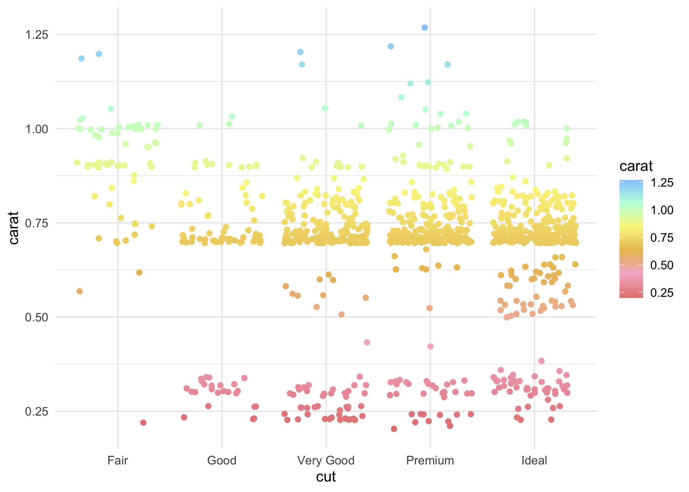

<!-- README.md is generated from README.Rmd. Please edit that file -->

# ggcute

<!-- badges: start -->

<!-- badges: end -->

A collection of cute things to use with ggplot2.

## Installation

You can install ggcute from GitHub with:

``` r
# install.packages("remotes")
remotes::install_github("sharlagelfand/ggcute")
```

## fairyfloss

`theme_fairyfloss()` is a theme based off of
[sailorhg](https://twitter.com/sailorhg)’s
[fairyfloss](https://sailorhg.github.io/fairyfloss/) text editor theme.

You can use it like any other ggplot2 theme:

``` r
library(ggplot2)
library(ggcute)

ggplot(nintendo_sales, aes(x = sales_million, y = console)) +
  geom_col() +
  facet_wrap(~sales_type) +
  theme_fairyfloss()
```


It’s probably (definitely) not a complete theme but at least it’s cute
☁️

There is a colour palette built in:

``` r
library(scales)

show_col(ggcute:::fairyfloss_colours)
```


You can use it in plots via
`scale_fill_fairyfloss()`:

``` r
ggplot(nintendo_sales, aes(x = sales_million, y = console, fill = sales_type)) +
  geom_col(position = position_dodge2(width = 0.1), alpha = 0.75) +
  labs(
    x = "Sales (million)", y = "Console", title = "Nintendo sales by console",
    subtitle = "As of December 31, 2019"
  ) +
  scale_fill_fairyfloss() +
  theme_fairyfloss()
```


or `scale_colour_fairyfloss()` (“color” instead of colour works
too):

``` r
ggplot(nintendo_sales, aes(x = sales_type, y = sales_million, colour = console)) +
  geom_jitter(size = 5, alpha = 0.5) +
  scale_colour_fairyfloss() +
  theme_fairyfloss(base_size = 12) +
  theme(
    legend.position = "bottom",
    legend.title = element_blank()
  )
```


Of course, you can use the palette without the theme and it’s still
extremely cute:

``` r
ggplot(head(diamonds, 1000), aes(x = cut, y = carat, colour = carat)) +
  geom_jitter() +
  scale_colour_fairyfloss(discrete = FALSE) +
  theme_minimal()
```



## sugarpilll

`theme_sugarpill()` is a theme based off the
[Sugarpill](https://www.instagram.com/sugarpill/) [Fun Size eyeshadow
palette](https://sugarpill.com/products/fun-size-palette). Similar to
fairyfloss, there are also `scale_*_sugarpill()` functions.

``` r
library(dplyr)
library(forcats)

nintendo_sales %>%
  mutate(console = fct_lump_n(console, n = 8, w = sales_million, other_level = "Other Consoles")) %>%
  group_by(console, sales_type) %>%
  summarise(sales_million = sum(sales_million)) %>%
  ungroup() %>%
  ggplot(aes(x = sales_type, y = sales_million, fill = console)) +
  geom_col(position = position_dodge2()) +
  facet_wrap(vars(console)) +
  labs(
    x = "", y = "",
    title = "Nintendo units sold (millions) by console",
    subtitle = "Data as of December 31, 2019"
  ) +
  scale_fill_sugarpill() +
  theme_sugarpill() +
  theme(legend.position = "none")
```


## animalcrossing
`theme_animalcrossing()` is a ggplot2 theme based off a palette generator 
[Canva](https://www.canva.com/colors/color-palette-generator/). Palette generated on image of a Nintendo Switch Animal Crossing New Horizons special edition. You can use this to do things like plot out how many bells you owe Tom Nook!


```{r}
ggplot(nintendo_sales, aes(x = console, y = sales_million)) +
  geom_col(fill = animalcrossing_colours["sky_blue"],
           color = animalcrossing_colours["dark_slate"]) +
  facet_wrap(~sales_type)+
  theme_animalcrossing() +
  coord_flip() +
  labs(title = "Nintendo Sales",
       subtitle = "Hardware vs. Software")
```


Below is the palette the package uses! Maybe we can add more colors from characters (Tom Nook, Blathers, Gulliver, etc.)

``` r
library(scales)

show_col(ggcute:::animalcrossing_colours)
```


Here is another example:

```{r}
  ggplot(nintendo_sales, aes(x = sales_type, y = sales_million, fill = sales_type))+
  geom_boxplot()+
  geom_jitter(color = animalcrossing_colours["dark_slate"])+
  scale_fill_animalcrossing(discrete = T)+
  theme_animalcrossing() +
  coord_flip() +
  labs(title = "Nintendo Sales",
       subtitle = "Hardware vs. Software",
       y = "Sales (Millions)",
       x = "Type",
       fill = "")
```


## Data

`ggcute` comes with one data set built in, Nintendo sales as of December
31, 2019:

``` r
nintendo_sales
#> # A tibble: 22 x 3
#>    console         sales_type sales_million
#>    <chr>           <chr>              <dbl>
#>  1 Nintendo Switch Hardware            52.5
#>  2 Nintendo Switch Software           311. 
#>  3 Nintendo 3DS    Hardware            75.7
#>  4 Nintendo 3DS    Software           382. 
#>  5 Wii U           Hardware            13.6
#>  6 Wii U           Software           103. 
#>  7 Wii             Hardware           102. 
#>  8 Wii             Software           921. 
#>  9 Nintendo DS     Hardware           154. 
#> 10 Nintendo DS     Software           949. 
#> # … with 12 more rows
```
